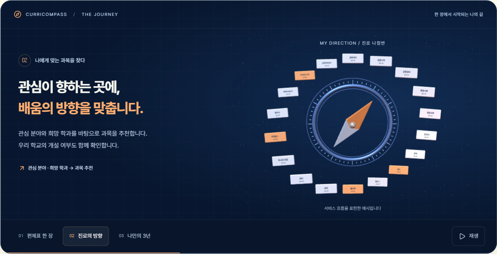
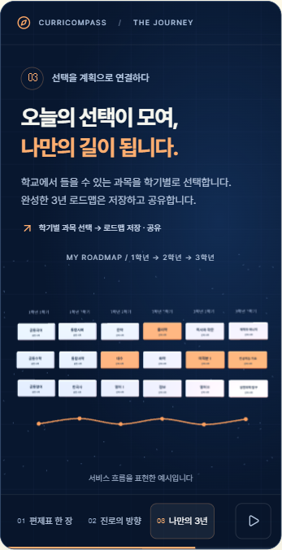

# 커리컴퍼스 소개 모션

랜딩의 첫 CTA 아래에 편제표 → 진로 나침반 → 3년 로드맵을 보여주는 18초 모션을 삽입했습니다. 실제 학교 데이터가 아닌 서비스 흐름 예시이며, AI 정리 뒤 교사가 검토한다는 단계도 명시합니다.

- `CompassFilm.tsx`: 서버에서 읽을 수 있는 설명·대체 그림, 장면 선택, 재생/일시정지, 화면 노출 및 접근성 설정 관리.
- `compass-scene.ts`: Three.js의 입체 카드·나침반·경로, GSAP 변형 타임라인. 외부 모델·이미지·API 호출 없음.
- `compass-film.module.css`: 블루·오렌지 브랜드에 맞춘 반응형 소개 영역.

3D 라이브러리는 소개 영역에 진입할 때 가져옵니다. 화면 밖/숨겨진 탭에서는 타이머를 멈추고, reduced-motion에서는 로드맵 정지 장면으로 시작합니다. WebGL 초기화 실패·context loss 시 HTML 그림과 설명이 남습니다. 캔버스는 보조기술에서 제외하고 버튼과 본문으로 동일한 흐름을 제공합니다. 화면 이탈 시 GPU 자원·이벤트·타임라인을 해제합니다.

## 검증 (2026-09-08)

- `pnpm run lint`: 오류 0, 기존 경고 2(전시관 img, 로드맵 미사용 타입).
- `pnpm run build`: 통과.
- `pnpm run test`: 19파일, 88테스트 통과.
- Chrome 실제 렌더: 1440×1000, 393×844. 320·393·768px 너비에서 가로 넘침 없음.
- 세 장면 선택, 일시정지 시 진행률 고정, 재생 시 진행, 화면 밖 자동 정지, reduced-motion 변경 시 정지 로드맵, 키보드 Enter로 장면 선택 확인.
- `webglcontextlost` 이벤트를 발생시켜 대체 화면과 비활성 재생 버튼 확인.
- 실기기 GPU 성능 측정은 실시하지 않음. 픽셀 비율은 최대 1.5로 제한.

